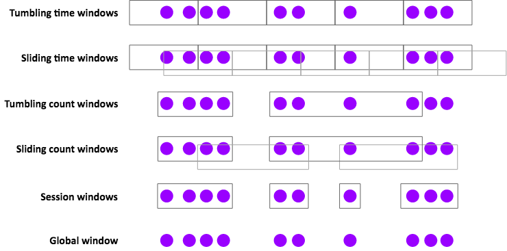

## Flink API编程（事件时间和水印）
支持事件时间的流处理器需要一种方法来衡量事件时间的进度,比如按照10分钟构建的窗口，需要知道当事件时间超过10分钟后需要进行通知，是的算子可以结束本轮运算。Flink中，这个衡量事件时间进度的机制是Watermarks。
event time(事件时间)和Watermark(水印)是Flink的两个核心概念，是Flink 实现 乱序处理、窗口计算的基础。

### 1 事件时间和水印(Event time and WaterMarks)
#### 1.1 event time
Flink 支持三种类型的时间：
* `event time`:事件时间，流上的事件真是发生的时间
* `ingestion time`:摄入时间，流上的事件进入Flink时的时间
* `Processing time`:处理时间，Flink的算子在处理该事件的时间
大多数场景使用`event time`，因为即使应用挂掉或者failover，重新运算后的结果仍能保持一致。Flink默认使用Processing time，如果需要使用其他类型的时间，可以按照如下显示指定：

```
final StreamExecutionEnvironment env =
  StreamExecutionEnvironment.getExecutionEnvironment();
env.setStreamTimeCharacteristic(TimeCharacteristic.EventTime);

```
指定`event time`后，我们需要在代码里实现一个`时间提取器`(Timestamp Extractor)和`水印生成器`(Watermark Generator)，这样Flink才能实现对`event time`的跟踪处理

#### 1.2 watermarks
通过一个简单的例子来说明我们为什么需要watermarks及其工作机制。例子中的流数据为带时间戳的事件，事件达到时是乱序的，流中的数字表示事件发生的时间，比如第一个到达的事件发生在t4时刻，第二个达到的事件发生在t2时刻，比第一个到达的时间早发生，完整的流如下：
```
··· 23 19 22 24 21 14 17 13 12 15 9 11 7 2 4 →
```
假设我们需对流中数据进行排序，这意味着我们的应用程序需要在流中的每个事件到达时进行处理，并将处理结果发送到一个新的有序（按照事件发生时间）的输出流。在实现过程中，我们会发现：
（1）进入排序算子的第一个元素(即事件)是`4`,但我们不能立即将这个元素发布到输出流。因为元素的到达时间是乱序的，更早发生的事件可能还未到达。事实上，我们以上帝视角会发现，排序算子至少需要等待元素`2`到达之后才能进行操作。

**总结：适当的缓存、适当的延迟是必须的**

（2）如果判断错误，那么程序可能永远等待。比如我们的应用程序第一个看到的元素`4`来了，接着`2`来了，那会不会有时间戳小于`2`呢？可能吧，如果这样考虑，我们只能永远等待，因为后续元素中没有`1`。

**总结：最终，我们必须勇敢将2作为排序流的开始元素**

（3）我们需要的是某种策略，定义对于任何给定的时间戳事件，何时停止等待更早发生的事件。

**总结：这就是水印所做的事情：水印定义了什么时候应该停止等待更早发生的事件。**

   Flink实现`event time`处理是通过在`watermark generators`在流中插入特定时间戳的元素，这些元素称为水印。
   什么时候应该停止等待，并将`2`发送到输出流？当一个时间戳为`2`的或者有时间戳更大的水印到达时，就是停止等待并发送`2`的时机。

（4）我们可以思考下生成水印的不同策略。
   我们知道每一个事件的到达都有一定的延迟，这些延迟各不相同，一些事件的延迟比其他事件的延迟更大。一种简单的方法是假设这些延迟均包含于一些最大延迟构成的区间。Flink将这种策略称为有界无序水印(`bounded-out-of-orderness watermarking`)。
   虽然可以想象一些更复杂的生成水印的方法，但对于大多数应用程序来说，这种延迟为固定值水印的效果已经足够好了。

##### 1.3 Working with Watermarks
为了进行基于`event time`的流式事件处理，Flink需要知道数据流中每个事件相对应的时间，Flink还需要数据流中包含了水印。官方的例子中，`Taxi data sources`已经考虑了这些细节，但在你自己的应用程序中，你需要考虑着这两个细节（这可以通过实现一个类，这个类从事件中抽取时间戳，并在需要的时候生成水印),最简单的方式就继承`BoundedOutOfOrdernessTimestampExtractor`，如下：
```
DataStream<MyEvent> stream = ...

DataStream<MyEvent> withTimestampsAndWatermarks =
  stream.assignTimestampsAndWatermarks(new MyExtractor);

public static class MyExtractor
    extends BoundedOutOfOrdernessTimestampExtractor<MyEvent>(Time.seconds(10)) {

  @Override
  public long extractTimestamp(MyEvent event) {
    return element.getCreationTime();
  }
}
```

### 2 窗口(Windows)
Flink具有非常有表现力的window语义，本小节学习：
* 1.windows如何在有界流上实现聚合计算
* 2.Flink支持的window类型
* 3.如何在DataStream程序中实现window聚合

#### 2.1 Introduction
在进行流处理时，我们经常希望对流的有界子集进行聚合分析计算，以便回答如下问题：
* 各个页面每分钟的浏览数
* 各个用户每周的登陆次数
* 各个传感器每分钟的最高温度

使用Flink计算窗口分析取决于两个主要抽象：
`Window Assigners`：负责将事件分配给窗口（根据需要创建新的窗口对象）的`窗口分配器`
`Window Functions`：应用于分配给窗口的事件的`窗口函数`

Flink的窗口API还具有触发器(`Triggers`)、Evictor(`Evictor`，这个词的意思是驱逐的意思，flink里的概念是在在window中收集的元素，可以用Evictor进行过滤)的概念，触发器决定何时调用window函数，Evictor可以删除窗口中收集的元素。

在基础的window中，你可以将窗口化应用于keyed stream，如下所示：
```
stream.
  .keyBy(<key selector>)
  .window(<window assigner>)
  .reduce|aggregate|process(<window function>)
```
你也可以对`non-keyed stream`使用窗口，但请记住，在这种情况下，Flink不会并行执行处理(因为对整个流进行的windowAll操作，只会在一个节点上执行)：
```
stream.
  .windowAll(<window assigner>)
  .reduce|aggregate|process(<window function>)
```

#### 2.2 Window Assigners
Flink有几种内置的`Window Assigners`，如下图所示：

 

`Window Assigners`的一些使用例子：
* Tumbling time windows(滚动窗口)
* * 每分钟的PV
* * TumblingEventTimeWindows.of(Time.minutes(1))

* Sliding time windows（滑动窗口）
* * 每分钟的PV,每10s计算一次
* * SlidingEventTimeWindows.of(Time.minutes(1), Time.seconds(10))

* Session windows（会话窗口）
* * 每个会话的PV, 其中会话是由至少30分钟的间隙定义的(如t1-t3，t32-t38,这是两个会话，中间的gap超过了30)。
* * EventTimeSessionWindows.withGap(Time.minutes(30))

窗口持续时间可以由以下方法指定：`Time.milliseconds(n)`, `Time.seconds(n)`, `Time.minutes(n)`, `Time.hours(n)`, and `Time.days(n)`.

基于时间的`Window Assigners`（包括会话窗口）支持`event-time`和`processing-time`两种类型。选择这两种类型的时间窗口时需要认真权衡：
在`processing-time`窗口中，你必须接受这些限制：
* 无法处理历史数据
* 无法正确处理无序数据
* 结果将是不确定的
优势是低延迟。

使用基于计数的窗口时，请记住，这些窗口在批处理(指窗口收集元素)完成之前不会触发`fire`，没有超时和处理部分窗口的选项，尽管你可以使用自定义触发器实现该行为。

全局`Window Assigners`将每个事件（具有相同的key）分配给相同的全局窗口。只有当你要使用自定义触发器进行自己的自定义窗口处理时，这才有用。
在大多数情况下，如果这看起来有用，你最好使用[另一节](https://training.ververica.com/lessons/processfunction.html)中描述的processFunction。 


#### 2.3 Window Functions
对于如何处理窗口内容，你有三种处理方式：
* 作为批处理，使用`processWindowFunction`，传递给函数一个带有窗口所有内容的迭代器；
* 以增量的方式，当每个事件分配给窗口时，调用`ReduceFunction`或`AggregateFunction`；
* 或者两者的组合，其中`ReduceFunction`或`AggregateFunction`的预聚合结果在触发窗口时提供给`ProcessWindowFunction`。

下面是方式1和方式3的示例。每个case，我们都会在1分钟的事件时间窗口中找到每个传感器的峰值，并生成包含（key, end-of-window-timestamp, max_value）的元组流。
 
#### 2.4 ProcessWindowFunction Example
```
DataStream<SensorReading> input = ...

input
  .keyBy(“key”)
  .window(TumblingEventTimeWindows.of(Time.minutes(1)))
  .process(new MyWastefulMax());//MyWastefulMax继承了ProcessWindowFunction类，必须实现process方法

public static class MyWastefulMax extends ProcessWindowFunction<
  SensorReading,                  // input type
  Tuple3<String, Long, Integer>,  // output type
  Tuple,                          // key type
  TimeWindow> {                   // window type
    
    @Override
    public void process(
      Tuple key,  //基于keyed stream 的滚动窗口，具有相同的key
      Context context, 
      Iterable<SensorReading> events, //迭代器，包含了窗口所有event
      Collector<Tuple3<String, Long, Integer>> out) {
        int max = 0;
        for (SensorReading event : events) {     //计算峰值
          if (event.value > max) max = event.value;
        }
		// note the rather hideous cast   //输出
        out.collect(new Tuple3<>((Tuple1<String>)key).f0, context.window().getEnd(), max));
    }
}
```

在这个例子中需要注意：
* key selector通过选择字段名并编码为String类型，这使得编译器不可能知道我们的的key原本就是String类型，因此key的类型在ProcessWindowFunction是一个tuple。注意代码最后一行中使用的强制转换。
* 分配给窗口的所有事件都必须在`keyed Flink state`中进行缓存，直到窗口被触发。这个代价相当昂贵。
* 我们的`processWindowFunction`被传递了一个上下文对象，从中我们可以获取有关该窗口的信息，其接口如下：
```
public abstract class Context implements java.io.Serializable {
    public abstract W window();
    
    public abstract long currentProcessingTime();
    public abstract long currentWatermark();

    public abstract KeyedStateStore windowState();
    public abstract KeyedStateStore globalState();
}
```

`windowSate` 和 `globalState`可以用来存放每个key，每个window，或者全局每个key的信息。这会非常有用，
比如你想记录当前window的一些信息在之后的window中使用。

#### 2.5 Incremental Aggregation Example
```
DataStream<SensorReading> input = ...

input
  .keyBy(x -> x.key)//不指定fieldname ,这种方式更鲁棒，能带出key
  .window(TumblingEventTimeWindows.of(Time.minutes(1)))
  .reduce(new MyReducingMax(), new MyWindowFunction());

private static class MyReducingMax implements ReduceFunction<SensorReading> {
  public SensorReading reduce(SensorReading r1, SensorReading r2) {
    return r1.value() > r2.value() ? r1 : r2;
  }
}

private static class MyWindowFunction extends ProcessWindowFunction<
  SensorReading, Tuple3<String, Long, SensorReading>, String, TimeWindow> {

  @Override
  public void process(
    String key,
    Context context,
    Iterable<SensorReading> maxReading,
    Collector<Tuple3<String, Long, SensorReading>> out) {

    SensorReading max = maxReading.iterator().next();
    out.collect(new Tuple3<String, Long, SensorReading>(key, context.window().getEnd(), max));
  }
}
```
在这个例子中，我们使用了更鲁棒的keyselector。还要注意，`iterable<sensorreading>`只包含一条记录，一条由`myreducingmax`预聚合的最大值记录。


#### 2.6 Late Events
默认情况下，使用`event-time`窗口时，晚到的事件会被删除。WindowAPI有两种选项可便于更好地晚到的事件。

你可以使用[Side Outputs](https://training.ververica.com/lessons/side-outputs.html)的机制，将要丢弃的事件收集到备用输出流。下面是一个例子：
```
OutputTag<Event> lateTag = new OutputTag<Event>("late"){};

SingleOutputStreamOperator<Event> result = stream.
  .keyBy(...)
  .window(...)
  .process(...);
  
DataStream<Event> lateStream = result.getSideOutput(lateTag);
```
你也可以指定可以接受的延迟间隔，在此期间，延迟的事件还会分配给合适的窗口（其状态将被保留)。
相应地，每个延迟事件都会导致窗口计算的触发延迟。

默认情况下，系统允许的延迟时间为0。换句话说，水印后面的元素会被被删除（或发送到`side output`），比如：
```
stream.
  .keyBy(...)
  .window(...)
  .allowedLateness(Time.seconds(10))
  .process(...);
```

#### 2.7 Surprises
Flink window API的某些方面的行为可能与你预期的不一样。基于[Stack Overflow](https://stackoverflow.com/questions/tagged/apache-flink) 出和[Flink用户邮件列表](https://flink.apache.org/community.html#mailing-lists)的常见问题
，下面是一些可能让你感到惊讶的关于Windows的事实。

**Sliding Windows 会产生多个副本**
滑动窗口分配程序可以创建许多窗口对象，并将每个事件复制到每个相关窗口中。例如，如果每15分钟有一个滑动窗口，窗口长度为24小时，则每个事件都将复制到4*24=96个窗口中。

**Time Windows 存在时间对齐问题**
如果你使用了一个小时长的`Time Windows`，并且在12:05开始运行应用程序，并不意味着第一个窗口将在1:05关闭。事实上第一个窗口长度为55分钟，在1:00关闭。

**Windows可以级联Window**
比如：
```
stream
  .keyBy(t -> t.key)
  .timeWindow(<time specification>)
  .reduce(<reduce function>)
  .timeWindowAll(<same time specification>)
  .reduce(<same reduce function>)
```
你可能期望Flink的runtime足够智能，能够为你进行并行的预聚合（如果您使用的是ReduceFunction或AggregateFunction），但事实并非如此。

**没有事件的TimeWindows不会有产出**
仅当事件分配给窗口时才创建窗口。因此，如果在给定的时间范围内没有事件，则不会产出任何结果。

**延迟的事件可能引起延迟合并(会话窗口中)**
会话窗口基于可合并窗口的抽象，每个元素刚开始都分配给一个新窗口，之后只要窗口之间的间隙足够小，就会合并窗口。通过这种方式，延迟到达的事件可以对先前已经分开的两个会话窗口的gap进行缩小，从而产生后期合并。


**Evictors(用于删除窗口中的元素)与增量聚合不兼容**
简单地说，这是正确的——你不能删除你没有存储的元素。但这意味着依赖于使用Evictors的设计正在采用某种反模式。


#### Further Reading
* [Introducing Stream Windows in Apache Flink](https://flink.apache.org/news/2015/12/04/Introducing-windows.html) (Apache Flink blog)
* [Windows](https://ci.apache.org/projects/flink/flink-docs-stable/dev/stream/operators/windows.html) (Apache Flink Documentation)


### 3 Lab2 窗口练习


